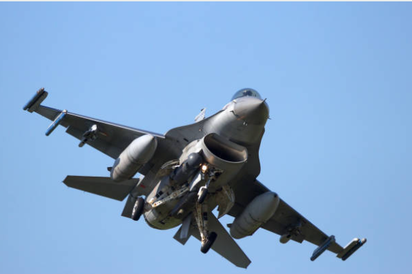
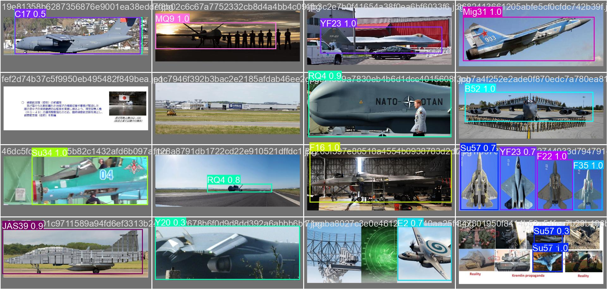

# SkyWarden ✈️

**AI-powered aerial image analysis that detects, identifies, and flags military aircraft in real time.**


SkyWarden is a computer-vision system that detects military aircraft in aerial images, classifies each as friendly or enemy, and raises an alert the moment a hostile aircraft is spotted.

## Table of Contents

- [Objective](#objective)
- [Architecture](#architecture)
- [Features](#features)
- [Demo](#demo)
- [Tech Stack](#tech-stack)
- [Project Structure](#project-structure)
- [Getting Started](#getting-started)
- [How It Works](#how-it-works)
- [Dataset](#dataset)
- [Results](#results)
- [Known Limitations](#known-limitations)
- [Roadmap](#roadmap)
- [Contributing](#contributing)
- [License](#license)
- [Acknowledgments](#acknowledgments)
- [Citation](#citation)
- [Support](#support)
- [Contributors](#contributors)

## Objective

SkyWarden demonstrates how modern computer vision can automatically detect and classify military aircraft from aerial imagery while providing an immediate friend-or-enemy assessment for situational awareness. It combines a YOLOv8 detector, a Segment-Anything-assisted labeling pipeline, and a Streamlit front end into a single end-to-end demo — from raw aerial imagery to an annotated, alert-triggering result.

## Architecture

```
Input Image
     │
     ▼
YOLOv8 Detection + Classification
     │
     ▼
Friend / Enemy Mapping
     │
     ▼
Annotated Output + Alert
```

Detection and classification happen in a single YOLOv8 pass (one model predicts both the box and the aircraft type); the friend/enemy step is a separate rule-based lookup against the static allegiance lists in `app.py`. See [How It Works](#how-it-works) for the full pipeline, including preprocessing and training.

## Features

- **Aircraft detection** — locates aircraft in an aerial image and draws bounding boxes with class name and confidence score.
- **77-class recognition** — recognizes 77 distinct aircraft types, from fighters and bombers to transports and UAVs.
- **Friend/enemy classification** — cross-references each detected type against a curated allegiance list and colors boxes accordingly (green = friend, red = enemy, white = unrecognized).
- **Real-time alerts** — surfaces a clear on-screen warning the moment any enemy aircraft is detected.
- **Web interface** — drag-and-drop image upload via Streamlit, no setup beyond installing dependencies.
- **Reproducible training pipeline** — scripts to go from raw labeled data to a trained YOLOv8 checkpoint, including SAM-assisted auto-labeling.

## Demo

| Sample input | Model validation predictions |
|---|---|
|  |  |

More raw sample inputs are in `images/`. Full evaluation plots and validation prediction grids from training are in `results/`. Note the grid above is YOLO's standard per-class training visualization — the live app's actual output uses green/red boxes for the friend/enemy call instead.

> If these don't render wherever you're previewing this file, it's because `images/` and `results/` need to sit alongside the README — the paths are relative to the repo, not broken links.

## Tech Stack

**Deep Learning & Computer Vision**
- [Ultralytics YOLOv8](https://github.com/ultralytics/ultralytics) — object detection
- [PyTorch](https://pytorch.org/) — model backend
- [OpenCV](https://opencv.org/) — image processing & annotation
- [Segment Anything (SAM)](https://github.com/facebookresearch/segment-anything) — automated bounding-box labeling

**Data & Evaluation**
- [NumPy](https://numpy.org/) · [Pandas](https://pandas.pydata.org/) · [Matplotlib](https://matplotlib.org/) · [scikit-learn](https://scikit-learn.org/)

**Application**
- [Streamlit](https://streamlit.io/) — web interface
- [python-dotenv](https://pypi.org/project/python-dotenv/) — environment configuration

## Project Structure

```
SkyWarden/
├── app.py                              # Streamlit app: detection + friend/enemy alerting
├── requirements.txt                    # Python dependencies
├── model                               # Pointer file — link to trained weights (see Getting Started)
├── images/                             # Sample aircraft images used for docs/demo
├── preprocessing/
│   ├── dataset_split_preprocessing.py  # CSV → YOLO labels, train/val/test split
│   ├── crop_preprocessing.py           # Restructures cropped, per-class images for classification training
│   └── SAM_Bounding_Box.py             # Auto-generates bounding boxes with Segment Anything
├── training/
│   ├── Full_Frame_Train.py             # Trains YOLOv8 on full aerial frames
│   ├── full_frame_freeze_train.py      # Resumes training with backbone frozen
│   └── crop_classification_train.py    # Fine-tunes on cropped, single-aircraft images
├── results/                            # Training curves & evaluation plots
├── .gitignore
└── README.md
```

